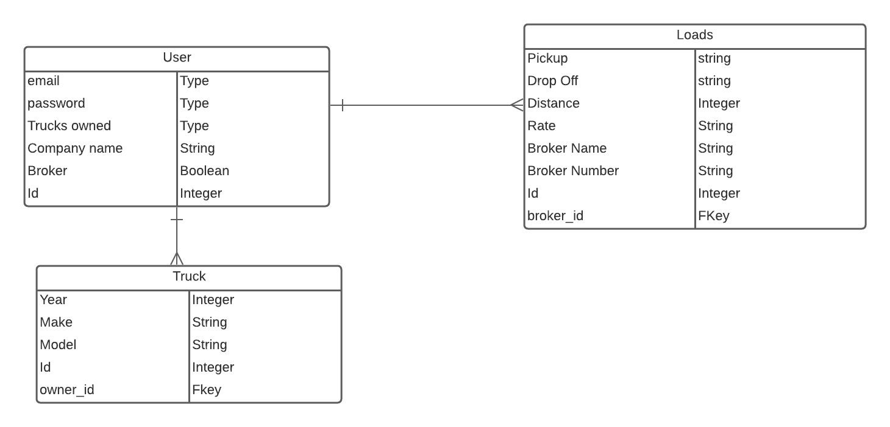

# FreightLoadboard

The trucking and freight industry is a multi-billion dollar industry. There are many players involved. With so many connections and transactions to be made there must be applications to help make the booking process frictionless. This application is a system for brokers to post loads from shippers and help drivers find and book loads.

# ERD

# Component Heirarchy Diagram

# Technologies Used
<li>  <a href = "https://trello.com/b/l7AGn3LY/freightloadboard">Trello </a>
<li>  <a href = "https://github.com/mhydara0624/FreightLoadboard">GitHub </a>
<li> Lucid Chart
<li> Javascript
<li> CSS
<li> Material UI
<li> PSQL
<li> Express
<li> React
<li> Node

# Getting Started

This application is simple and easy to use. When you initially come to the page you can register and login. After logging in you will have the page open to the authenticated options and will be able to post loads and/or trucks. There is a profile page to manage your trucks and a broker page to manage loads. You are able to edit and delete listings as you please. There is full crud functionality on both the load and truck models. The home page shows a list of loads and contact information for the companies. However to truly become a part of the community you have to become a member.